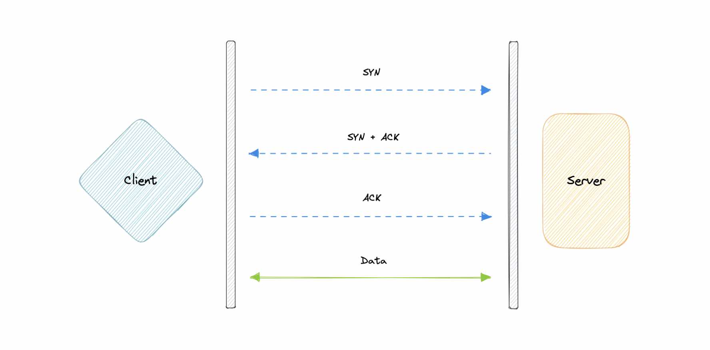
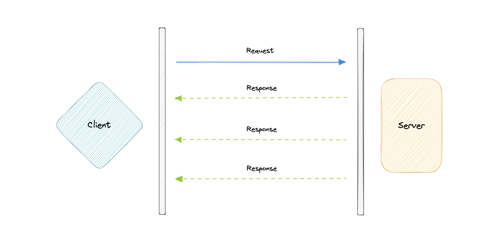
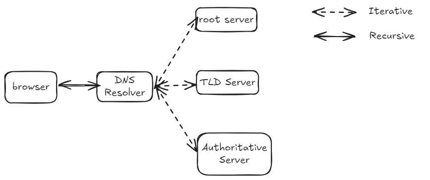
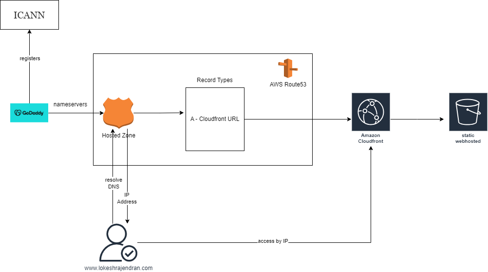

# system-design
My System Design Reference

# What is system design?

Simply put, System Design is about Planning and Structuring a system in a way that ensures it meets both functional and non functional requirements (performance, scalability, reliability, and security).

# Why it is Important?

System Design rovides a blueprint that guides development, preventing costly redesigns and ensuring the system meets user and business needs. System Design is the first step to start with once we start developing a large scale system.

# System Design Views

When starting with a system design we start with 
*High-Level Design (HLD)* 
In the HLD we focus on System's Components, Interactions between them and Data Flow between them. In HLD we will be creating

1. *Architecture Diagram:* Illustrates the system's major components and their interactions.
2. *Component Design:* Defines how each component or service will be developed and interact with others.
3. *Data Flow Diagrams:* Depict how data moves through the system and is processed.
4. *Technology Stack:* Choosing appropriate technologies for different parts of the system.

Once we are done with HLD we will start our *Low Level Design (LLD)*. In LLD we furthur focus on detailed design of each component we designed in HLD. Like - 
1. *Class Diagrams*: Describe the object-oriented design and relationships between classes.
2. *Database Schema Design*: Details the structure of the database, including tables, relationships, and indexing strategies.
3. *API Design*: Specifies the endpoints, methods, and data structures used for communication between different parts of the system.
4. *Algorithms and Logic*: Defines the algorithms and logic that each component will use.

In System Design while we are designing Functinal Capabilites of the system it is very important to consider non functional attributes like -
*Scalability*: How the system can handle growth, such as increased user load or data volume.
*Performance*: Ensuring the system can process requests efficiently.
*Reliability*: Ensuring the system is robust and can handle failures gracefully.
*Security*: Protecting the system from unauthorized access and vulnerabilities.
*Maintainability*: Designing the system so it can be easily updated and managed over time.
*Cost*: Balancing the budget while meeting the system’s needs.

# OSI Model
The OSI Model is a logical and conceptual model that defines network communication used by systems open to interconnection and communication with other systems. The Open System Interconnection (OSI Model) also defines a logical network and effectively describes computer packet transfer by using various layers of protocols.

# Layers in OSI Model
The seven abstraction layers of the OSI model can be defined as follows, from top to bottom:

### Application

This is the only layer that directly interacts with data from the user. Software applications like web browsers and email clients rely on the application layer to initiate communication. But it should be made clear that client software applications are not part of the application layer, rather the application layer is responsible for the protocols and data manipulation that the software relies on to present meaningful data to the user. Application layer protocols include HTTP as well as SMTP.

### Presentation

The presentation layer is also called the Translation layer. The data from the application layer is extracted here and manipulated as per the required format to transmit over the network. The functions of the presentation layer are translation, encryption/decryption, and compression.

### Session

This is the layer responsible for opening and closing communication between the two devices. The time between when the communication is opened and closed is known as the session. The session layer ensures that the session stays open long enough to transfer all the data being exchanged, and then promptly closes the session in order to avoid wasting resources. The session layer also synchronizes data transfer with checkpoints.

### Transport

The transport layer (also known as layer 4) is responsible for end-to-end communication between the two devices. This includes taking data from the session layer and breaking it up into chunks called segments before sending it to the Network layer (layer 3). It is also responsible for reassembling the segments on the receiving device into data the session layer can consume.

### Network

The network layer is responsible for facilitating data transfer between two different networks. The network layer breaks up segments from the transport layer into smaller units, called packets, on the sender's device, and reassembles these packets on the receiving device. The network layer also finds the best physical path for the data to reach its destination this is known as routing. If the two devices communicating are on the same network, then the network layer is unnecessary.

### Data Link

The data link layer is very similar to the network layer, except the data link layer facilitates data transfer between two devices on the same network. The data link layer takes packets from the network layer and breaks them into smaller pieces called frames.

### Physical

This layer includes the physical equipment involved in the data transfer, such as the cables and switches. This is also the layer where the data gets converted into a bit stream, which is a string of 1s and 0s. The physical layer of both devices must also agree on a signal convention so that the 1s can be distinguished from the 0s on both devices.

# TCP and UDP

## TCP

Transmission Control Protocol (TCP) is connection-oriented, meaning once a connection has been established, data can be transmitted in both directions. TCP has built-in systems to check for errors and to guarantee data will be delivered in the order it was sent, making it the perfect protocol for transferring information like still images, data files, and web pages.

But while TCP is instinctively reliable, its feedback mechanisms also result in a larger overhead, translating to greater use of the available bandwidth on the network.

## UDP

User Datagram Protocol (UDP) is a simpler, connectionless internet protocol in which error-checking and recovery services are not required. With UDP, there is no overhead for opening a connection, maintaining a connection, or terminating a connection. Data is continuously sent to the recipient, whether or not they receive it.

It is largely preferred for real-time communications like broadcast or multicast network transmission. We should use UDP over TCP when we need the lowest latency and late data is worse than the loss of data.

## TCP vs UDP

TCP is a connection-oriented protocol, whereas UDP is a connectionless protocol. A key difference between TCP and UDP is speed, as TCP is comparatively slower than UDP. Overall, UDP is a much faster, simpler, and more efficient protocol, however, retransmission of lost data packets is only possible with TCP.

TCP provides ordered delivery of data from user to server (and vice versa), whereas UDP is not dedicated to end-to-end communications, nor does it check the readiness of the receiver.

| Feature             | TCP                                         | UDP                                |
| ------------------- | ------------------------------------------- | ---------------------------------- |
| Connection          | Requires an established connection          | Connectionless protocol            |
| Guaranteed delivery | Can guarantee delivery of data              | Cannot guarantee delivery of data  |
| Re-transmission     | Re-transmission of lost packets is possible | No re-transmission of lost packets |
| Speed               | Slower than UDP                             | Faster than TCP                    |
| Broadcasting        | Does not support broadcasting               | Supports broadcasting              |
| Use cases           | HTTPS, HTTP, SMTP, POP, FTP, etc            | Video streaming, DNS, VoIP, etc    |

# Domain Name System (DNS)

In the above sections we learnt about IP Addresses which enables us to identify and connect with other machines in the network. But we humans are more comfortable calling by names (lokeshrajendran.com) instead of numbers. (92.32.33.22). This introduces us with DNS. Which is a  hierarchical and decentralized naming system used for translating human-readable domain names to IP addresses.

When you hit a url in the browser the following steps happens

1.  The query goes to the internet and will received by an server called DNS Resolver.A DNS resolver (also known as a DNS recursive resolver) is the first stop in a DNS query. The recursive resolver acts as a middleman between a client and a DNS nameserver. The DNS resolver will search for the ip address of the url in the cache. If it is not their it will send a request to root nameserver.
2. A root server accepts a recursive resolver's query which includes a domain name, and the root nameserver responds by directing the recursive resolver to a TLD nameserver, based on the extension of that domain (.com, .net, .org, etc.). The root nameservers are overseen by a nonprofit called the Internet Corporation for Assigned Names and Numbers (ICANN). There are 13 DNS root nameservers known to every recursive resolver. 
3. TLD nameserver
A TLD nameserver maintains information for all the domain names that share a common domain extension, such as .com, .net, or whatever comes after the last dot in a URL.
Management of TLD nameservers is handled by the Internet Assigned Numbers Authority (IANA), which is a branch of ICANN. The IANA breaks up the TLD servers into two main groups:
Generic top-level domains: These are domains like .com, .org, .net, .edu, and .gov.
Country code top-level domains: These include any domains that are specific to a country or state. Examples include .uk, .us, .ru, and .jp.
The TLD nameserver will direct the recursive resolver to a Authoritative server.
4. The authoritative nameserver is usually the resolver's last step in the journey for an IP address. The authoritative nameserver contains information specific to the domain name it serves (e.g. google.com) and it can provide a recursive resolver with the IP address of that server found in the DNS A record, or if the domain has a CNAME record (alias) it will provide the recursive resolver with an alias domain, at which point the recursive resolver will have to perform a whole new DNS lookup to procure a record from an authoritative nameserver (often an A record containing an IP address). If it cannot find the domain, returns the NXDOMAIN message.

## Query Types

There are three types of queries in a DNS system:

### Recursive

In a recursive query, a DNS client requires that a DNS server (typically a DNS recursive resolver) will respond to the client with either the requested resource record or an error message if the resolver can't find the record.

### Iterative

In an iterative query, a DNS client provides a hostname, and the DNS Resolver returns the best answer it can. If the DNS resolver has the relevant DNS records in its cache, it returns them. If not, it refers the DNS client to the Root Server or another Authoritative Name Server that is nearest to the required DNS zone. The DNS client must then repeat the query directly against the DNS server it was referred.

### Non-recursive

A non-recursive query is a query in which the DNS Resolver already knows the answer. It either immediately returns a DNS record because it already stores it in a local cache, or queries a DNS Name Server which is authoritative for the record, meaning it definitely holds the correct IP for that hostname. In both cases, there is no need for additional rounds of queries (like in recursive or iterative queries). Rather, a response is immediately returned to the client.

## Record Type

We have seen what is DNS and how DNS Name is resolved. Most of the time these things are taken care of we don't need to worry about it. But when we are configuring domain we need a good understanding of DNS Record Types.

DNS Record (also called Zone files) are instructions that live in authoritative DNS servers and provide information about a domain including what IP address is associated with that domain and how to handle requests for that domain.

Some commonly used Record Types are :

- **A (Address record)**: This is the record that holds the IP address of a domain.
- **AAAA (IP Version 6 Address record)**: The record that contains the IPv6 address for a domain (as opposed to A records, which stores the IPv4 address).
- **CNAME (Canonical Name record)**: Forwards one domain or subdomain to another domain, does NOT provide an IP address.
- **MX (Mail exchanger record)**: Directs mail to an email server.
- **TXT (Text Record)**: This record lets an admin store text notes in the record. These records are often used for email security.
- **NS (Name Server records)**: Stores the name server for a DNS entry.
- **SOA (Start of Authority)**: Stores admin information about a domain.
- **SRV (Service Location record)**: Specifies a port for specific services.
- **PTR (Reverse-lookup Pointer record)**: Provides a domain name in reverse lookups.
- **CERT (Certificate record)**: Stores public key certificates.

## Subdomains

A subdomain is an additional part of our main domain name. It is commonly used to logically separate a website into sections. We can create multiple subdomains or child domains on the main domain.

For example, `blog.lokeshrajendran.com` where `blog` is the subdomain, `lokeshrajendran` is the primary domain and `.com` is the top-level domain (TLD). Similar examples can be `support.lokeshrajendran.com` or `careers.lokeshrajendran.com`.

## DNS Zones

A DNS zone is a distinct part of the domain namespace which is delegated to a legal entity like a person, organization, or company, who is responsible for maintaining the DNS zone. A DNS zone is also an administrative function, allowing for granular control of DNS components, such as authoritative name servers.

## DNS Caching

A DNS cache (sometimes called a DNS resolver cache) is a temporary database, maintained by a computer's operating system, that contains records of all the recent visits and attempted visits to websites and other internet domains. In other words, a DNS cache is just a memory of recent DNS lookups that our computer can quickly refer to when it's trying to figure out how to load a website.

The Domain Name System implements a time-to-live (TTL) on every DNS record. TTL specifies the number of seconds the record can be cached by a DNS client or server. When the record is stored in a cache, whatever TTL value came with it gets stored as well. The server continues to update the TTL of the record stored in the cache, counting down every second. When it hits zero, the record is deleted or purged from the cache. At that point, if a query for that record is received, the DNS server has to start the resolution process.

## Examples

Widely used managed DNS solutions:

- [Route53](https://aws.amazon.com/route53)
- [Cloudflare DNS](https://www.cloudflare.com/dns)
- [Google Cloud DNS](https://cloud.google.com/dns)
- [Azure DNS](https://azure.microsoft.com/en-in/services/dns)
- [NS1](https://ns1.com/products/managed-dns)

I used Route53 to configure my Domain lokeshrajendran.com. Lets see how to do it.

I have bought my domain lokeshrajendran.com on Godady. Godady is a Domain Registrar. They register the domain with ICANN on behalf of you. Since they are the registrar it is not neccessarly required for them to manage it. You can manage it using DNS Zones (remember the definition above). 

In AWS we have Managed DNS solution called ROUTE53 which will allow us to create our DNS Zone through Hosted Zones. I have my website sitting in AWS S3 and I am serving the content through CDN called CloudFront. We will see more about CDN and Static Hosting soon. But for now assume they are serving our website from an machine with an IP attached.

Once the Hosted Zone is created it will give few nameservers. We can replace the nameserver in the Godady with the nameservers provided by the Hosted Zone. 

In the Hosted Zone I will create a Record Type of Type A which points to the address of the Cloudfront. Now when some one search for the domain lokeshrajendran.com. The DNS resolver will resolve the request to the IP address of the cloudfront.

# Load Balancing

Load Balancer helps us to distribute incoming network traffic across multiple resources ensuring high availability and reliability by sending requests only to resources that are online. This provides the flexibility to add or subtract resources as demand dictates.

Modern high-traffic website must server hunderds of concurrent request at once. To cost-effectively scale to meet these high volumes, modern computing best practice generally requires adding more servers. A load balancer can sit in front of the servers and route client requests across all servers. The routing is done in a way that we are maximising the speed and utiltization of the resources.

Load balancer is so good that it will make sure.

1. No single server is overloaded.
2. Make sure if a server is down. The request is routed to healthy server.
3. When a new server is added it automatically sends request to the server.

## Distributing Workloads

Loadbalancer can distribute the requests based on:

1. Host Name: Distributes requests based on the requested hostname.
2. Path Based: Using the entire URL to distribute requests as opposed to just the hostname.
3. Content-based: Inspects the message content of a request. This allows distribution based on content such as the value of a parameter.

Load balancer operate in Two Layers

1. Network Layer (Layer 4 Load balancer): This is the load balancer that works at the network's transport layer, also known as layer 4. This performs routing based on networking information such as IP addresses and ports and is not able to perform content-based routing. These are often dedicated hardware devices that can operate at high speed.
2. Application Layer (Layer 7 Load Balancer): This is the load balancer that operates at the application layer, also known as layer 7. Load balancers can read requests in their entirety and perform content-based routing. This allows the management of load based on a full understanding of traffic.

We have learnt about Loadbalancer and its type. Now we will learn different ways to route traffic using the Load balancer
